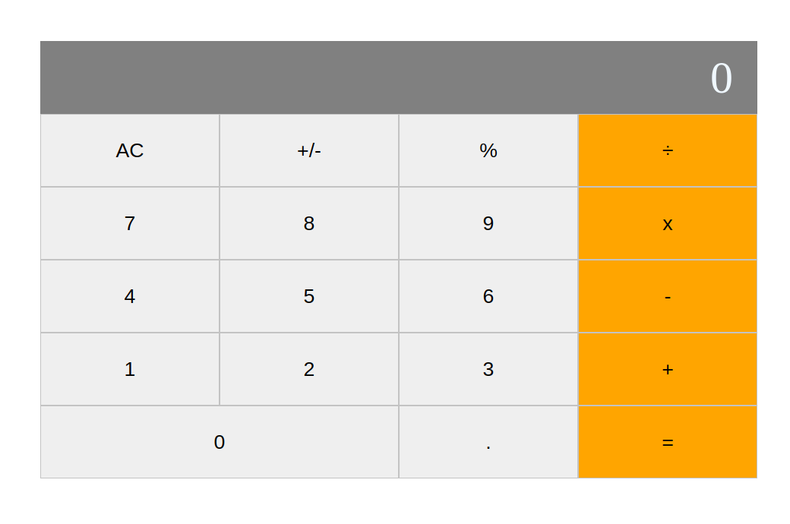

# Math Magicians

> One paragraph statement about the project.

Additional description about the project and its features.

## Built With

- CSS
- ReactJs

## Live Demo

[Live Demo Link](https://livedemo.com)

## Getting Started

### Prerequisites

### Setup

- Clone the repository: 
  "git clone git@github.com:Mehdi-Rh/Math-Magicians.git"

- Access the folder
- Install packages
  "npm i"
- Run the app 
  "npm start"

## Authors

👤 **Mehdi Rahal**

- GitHub: [@Mehdi-Rh](https://github.com/Mehdi-Rh)
- Twitter: [@MRahal92](https://twitter.com/MRahal92)
- LinkedIn: [mehdi-rahal22](https://www.linkedin.com/in/mehdi-rahal22/)

## 🤝 Contributing

Contributions, issues, and feature requests are welcome!

Feel free to check the [issues page](https://github.com/Mehdi-Rh/Math-Magicians/issues).

## Show your support

Give a ⭐️ if you like this project!

## Acknowledgments

- Hat tip to anyone whose code was used
- Inspiration
- etc

## 📝 License

This project is [MIT](./MIT.md) licensed.